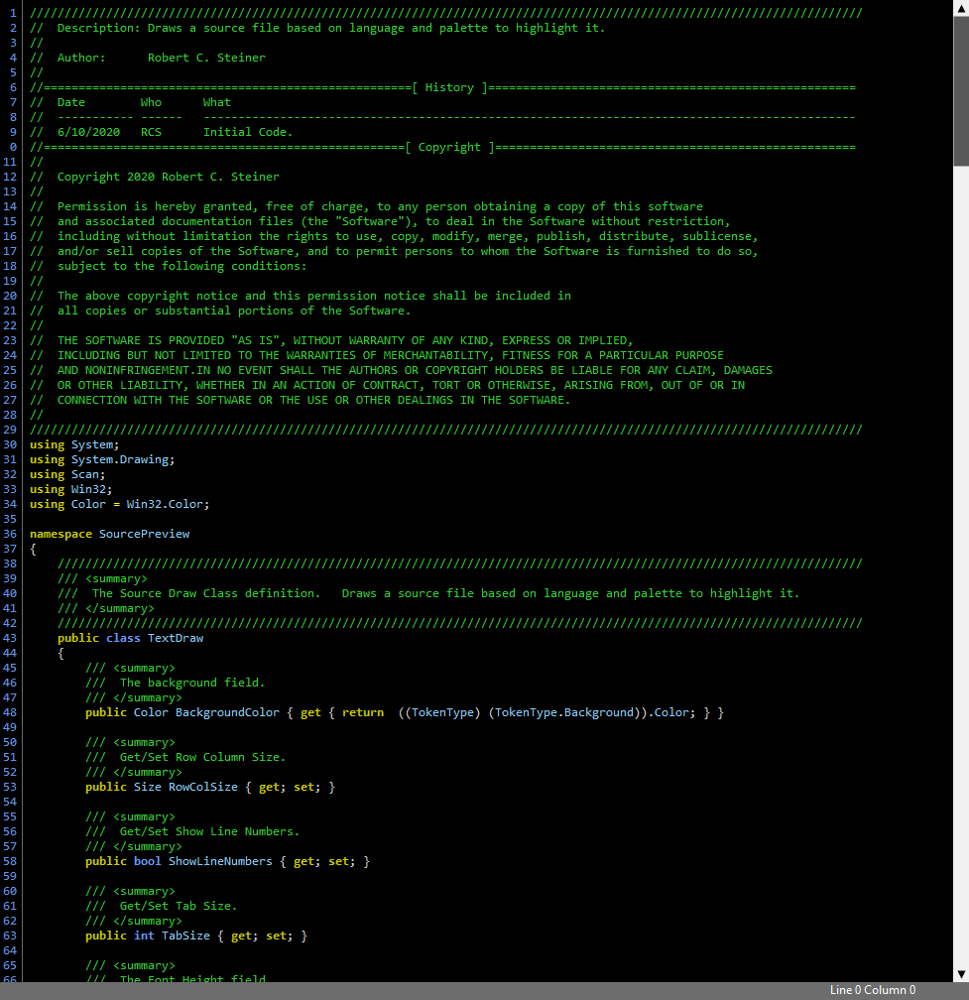
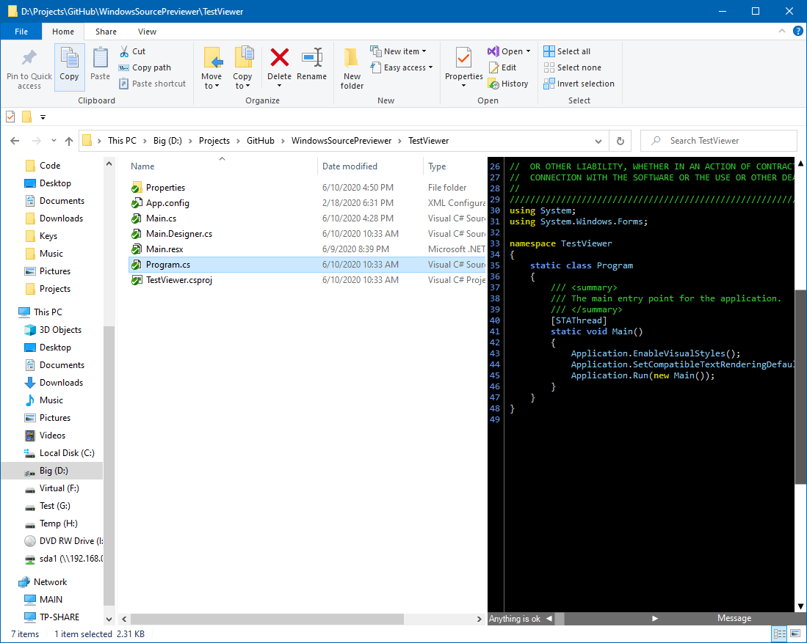

# Windows Source Previewer
A windows file explorer extension to show syntax highlighted files in explorer's preview pane.  Supports over 200 file extensions.

### Extensions supported:
user config as mx ada ads adb asm mib asp au3 avs avsi bash sh bsh csh bash_profile bashrc profile bat cmd nt bb ml mli sml thy cmake cbl cbd cdb cdc cob cpy copy lst coffee litcoffee h hh hpp hxx cpp cxx cc ino cs orc sco csd css d txt text diagram diff patch erl hrl src em forth f for f90 f95 f2k f23 f77 bas bi g grammar err production lstraw  hs lhs las html htm shtml shtm xhtml xht hta hex ini inf url wer iss java js jsm jsx ts tsx json jsp kix tex sty lsp lisp ll lua mak mk md markdown m mms nim tab spf nsi nsh mm osx pas pp p inc lpr pl pm plx php php3 php4 php5 phps phpt phtml ps ps1 psm1 properties pc pb py pyw r s splus rc r2 r3 reb reg rb rbw rs scm smd ss st scp out sql mot srec swift tcl tek t2t vb vbs v sv vh svh vhd vhdl pro cl i pack ph xml xaml xsl xslt xsd xul kml svg mxml xsml wsdl xlf xliff xbl sxbl sitemap gml gpx plist vcproj vcxproj csxproj vbproj dbproj yml yaml z c lex

# Installing
The binary is supplied in the *bin* folder.

 To install:

1) Run the visual studio developer command line tool with *adminstrator permissions*.
2) In the **bin** folder, run __install.bat__.
3) To uninstall, run __uninstall.bat__.

# Snapshots
The include test program can show a file in the viewer panel.

In File Explorer.

# Building
The project is built in Visual Studio 2019.  Open the solution and compile.  In the bin folder (debug or release), are batch files  to install (install.bat) and uninstall (uninstall.bat) the previewer into windows.  The TestViewer project is an executable that can be used to test the viewer and run it.

#### Important note: 
*If you wish to build it and debug it, then you **MUST** uninstall it first because the debugger will load the version in the GAC and not run the code you modified and want to test.*

# Design Notes
The basic previewer handler code comes from a 2007 MSDN article by Stephen Toub. [Writing your own preview handlers](https://docs.microsoft.com/en-us/archive/msdn-magazine/2007/january/windows-vista-and-office-writing-your-own-preview-handlers).  There is a lot of file types listed and I haven't tested most.  All are in the style\*.lang files.  So any fixes or updates are welcome.

The design of the source viewer is based on a simple byte buffer with character classifiers (lexers).  After looking at the BOM of the file, it choses an ASCII, UTF8, Unicode Big Endian, Unicode Little Endian, character reader.  Then uses the extension to pick the character classifier. No strings are extracted from the raw byte array, the sub-regions are passed to Win32 text drawing and measuring functions directly.  The goal was to eliminate a lot of string generation and be very fast.  Originally I tried other editors like Fireball and Avalon, but they are slow and the file explorer responed very slow.  

I also include the original file previewers from the Toub article so you can play with them too.  It defaults to a Dark background, but the **default.palette** file can be change to have other schemes. It does support multiple palettes (styles) but I implemented only one so far.
